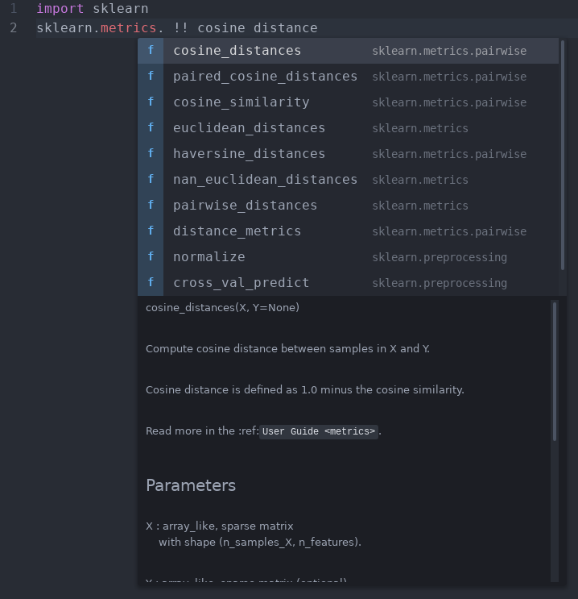
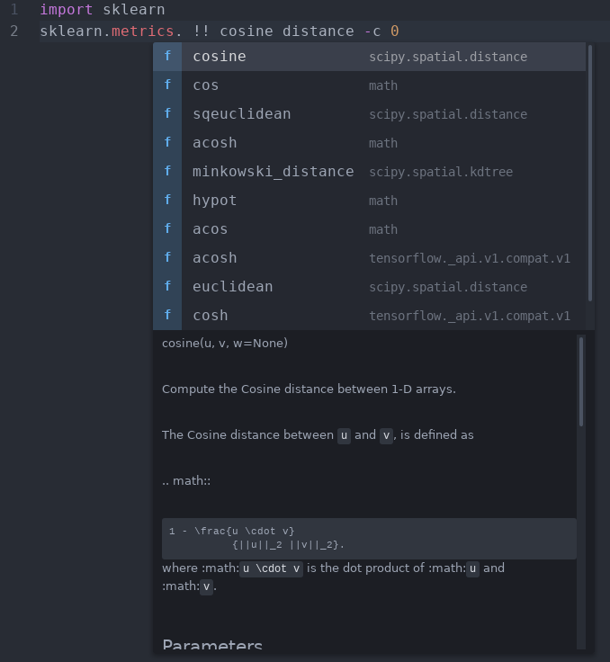

# **PySearch**

## A faster way to code

**PySearch** provides intelligent completion suggestions that improve on ordinary Google search, by incorporating the context surrounding each query and learning on the fly.

Because we're in beta, the service is free for a limited number of users.


## Getting Started:

1. Download [pyls](https://github.com/palantir/python-language-server):
  ```
   pip install python-language-server
  ```

2. Add your python runtime to the PySearch config.

  Mac:   `Cmd-Shift-P -> Preferences: Open User Settings -> Extensions -> PySearch`

  Linux: `Ctrl-Shift-P -> Preferences: Open User Settings -> Extensions -> PySearch`


## Using PySearch:

To make a PySearch query, type the delimiter (`!!` *by default, but user-configurable*) to begin a search:





For more control over query results, try adding the `--context` flag (alias `-c`) anywhere in your query
to scale context sensitivity.

The `--context` flag takes integer values from `0` through `5`, where higher numbers increase context sensitivity.



While PySearch searches only functions across Python 3.7+, broader coverage is currently in alpha. Our search indexes are hosted in PySearch Cloud, and we're actively working on rolling out a local version. All requests are TLS/SSL encrypted, anonymized, and **never** sold or shared.


## Known Issues


## Release Notes


### 0.2.3

Initial release

___

Made with ❤ by Flowbot Inc
